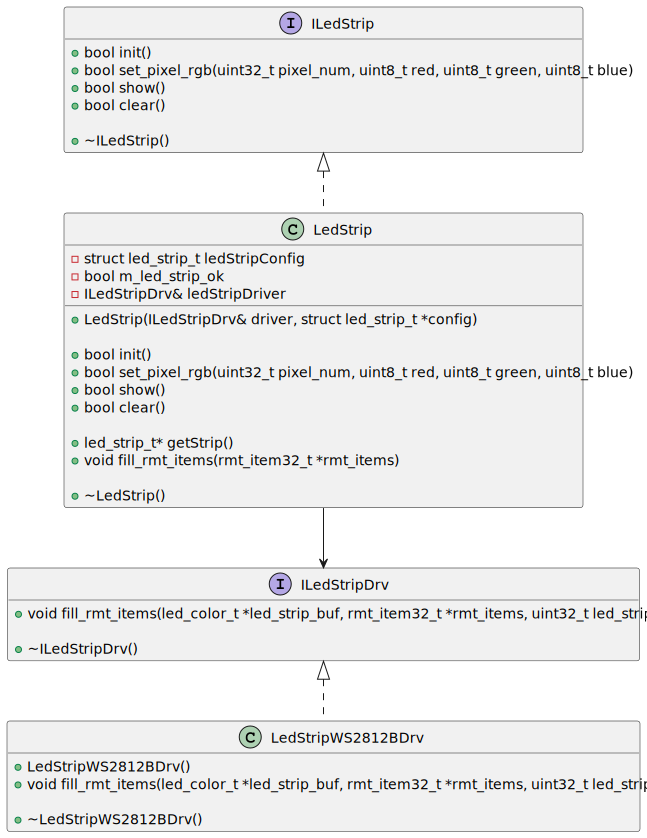

# ESP32 IOT Project 

ESP32 project for environmental sensor

## Description

Hardware used: ESP32-WROOM-32U, BME280 sensor, WS2812B led strip.<br>
Connection of the ESP32 to the internet is made using wifi.<br>
Sending and receiving data is done using public MQTT broker.<br>
User interface and checking thresholds is made using node-red running on windows.<br>

BME280 and BMP280 sensors driver is using I2C.<br>
WS2812B led strip driver is using the RMT peripheral.<br>

### How to use BME280 driver

Diagram of EnvSensBME280Drv and EnvSensBMP280Drv driver classes:


EnvSensBME280Drv class of BME280 driver is located in env_sens_bme280_drv.hpp. This project also has driver for the BMP280 sensor. The driver supports:

Initialization of the sensor and I2C:
```cpp
return_code init()
```

Setting sensor mode:
```cpp
return_code startContinuousMeasurements();
return_code startSingleMeasurement();
return_code stopMeasuring();
```

Burst reading data from sensor. This function reads the date from sensor all at once and calculates compensated measurement values
```cpp
void process();
```

Returning compensated measurement values. These functions return measurement values after succesfull read from sensor
```cpp
return_code readTemperature(int32_t &temperature);
return_code readHumidity(uint32_t &humidity);
return_code readPressure(uint32_t &pressure);
```

Reading sensor measurement state:
```cpp
return_code getMeasurementState();
```

### How to use WS2812B LED strip driver

Diagram of LedStrip base class and LedStripWS2812BDrv class:


LedStrip base class is located in led_strip_base.hpp. LedStripWS2812BDrv class, containing functions specific to the WS2812B LED strip, is located in led_strip_ws2812b_drv.hpp.

The WS2812B LED strip driver is based on [ESP32 Addressable LED Strip Library](https://github.com/Lucas-Bruder/ESP32_LED_STRIP/blob/master/README.md) made by Lucas Bruder.


### Tasks

This project contains three FreeRTOS tasks that are created in main.cpp

* Reading data from BME280 sensor is handled by myEnvSensTask<br>
* WS2812B LED strip is handled by led_strip_task<br>
* WIFI and MQTT are handled by myMQTTtask<br>

### User Interface

UI for this project is made using node-red running on windows.<br>
The node-red flow receives data from MQTT broker and sends information about exceeding the threshold values.<br>
The UI consists of charts displaying measurements and sliders for setting threshold values.<br>


## Dependencies

* PlatformIO IDE for VSCode to compile the project code<br>
* node-red for user interface<br>

## Getting Started

https://platformio.org/install/ide?install=vscode


## Version History

* 0.1
    * Initial Release

## Acknowledgments

Inspiration, code snippets, etc.
* [espressif I2C EEPROM example](https://github.com/espressif/esp-idf/tree/master/examples/peripherals/i2c/i2c_eeprom)
* [espressif Wi-Fi Station Example](https://github.com/espressif/esp-idf/tree/master/examples/wifi/getting_started/station)
* [espressif ESP-MQTT custom outbox sample application](https://github.com/espressif/esp-idf/tree/master/examples/protocols/mqtt/custom_outbox#esp-mqtt-custom-outbox-sample-application)
* [binnes Node-RED workshop](https://binnes.github.io/esp8266Workshop/index.html)
* [espressif ESP-MQTT SSL Sample application](https://github.com/espressif/esp-idf/tree/master/examples/protocols/mqtt/ssl_mutual_auth)
* [Lucas-Bruder ESP32 Addressable LED Strip Library](https://github.com/Lucas-Bruder/ESP32_LED_STRIP)
